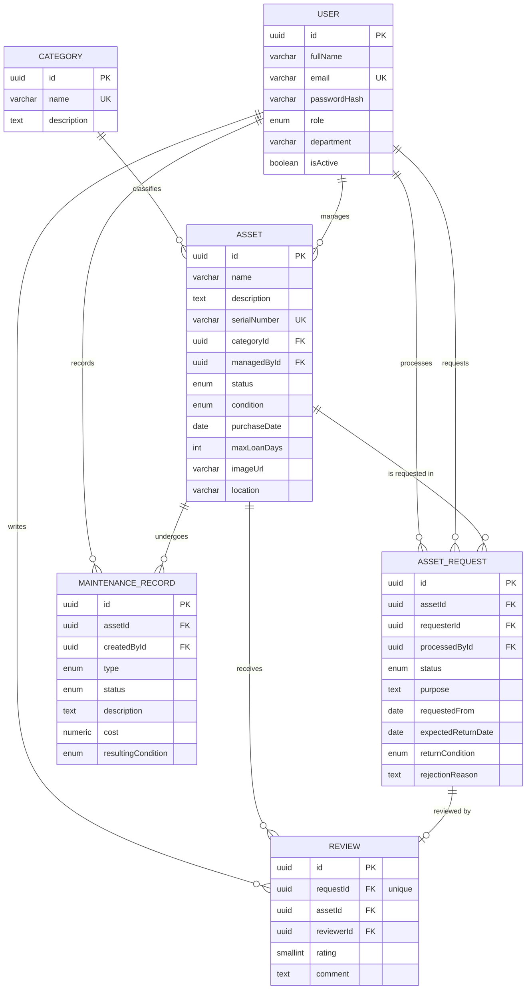

**Final Project Report**
========================================================================

# 1. Basic Information

Project Title: AssetFlow – IT Asset Management System
Fullname: Ashwin R
Student ID: 21F300426
Term: T22026_cs4010
Repository layout: `backend/` (Express + TypeORM API), `frontend/` (React SPA), `docs/` (design documents), `README.md` (setup and demo guide)

# 2. Problem Statement

Organizations depend on laptops, monitors, projectors, docking stations, headsets and other IT equipment, yet many still track them in spreadsheets. The result is misplaced units, double allocations, slow approvals and no reliable maintenance history.

**AssetFlow** is a web-based IT Asset Management System that centralizes the full lifecycle of every physical unit: cataloguing, request and approval, allocation, return, maintenance, retirement and post-loan feedback. Employees browse and request available units, IT Staff process requests and record maintenance, and Administrators manage users and categories and monitor the whole system from a dedicated dashboard.

The system is built for three user groups, **Administrators, IT Staff and Employees**, with Role-Based Access Control enforced at the API. Every state change of an asset happens through an explicit workflow, so the inventory can never show a unit as both available and on loan, and every request, maintenance record and review is traceable to a person and a unit.

# 3. System Overview

AssetFlow is a client-server application. The React frontend talks only to the Express REST API under `/api`; the API owns all business rules and persists data in PostgreSQL through TypeORM. The two halves are separate npm projects and can be started, tested and built independently.

```
Browser ── React 18 + Vite + React Router + Bootstrap 5 ── axios ──▶ /api (JSON)
                                                                       │
Express 4 + TypeScript: routes → validate (zod) → authenticate (JWT) → authorize (roles) → controller → service → TypeORM ──▶ PostgreSQL
```

## Major Components

* **Authentication & Authorization** – JWT login, bcrypt password hashing, `authenticate` and `authorize(...roles)` middleware, ownership checks inside services.
* **User Management** – Admin creates accounts of any role, edits role/department, activates and deactivates users; public registration always creates an Employee.
* **Category Management** – Admin-maintained categories used as a foreign key and filter for assets.
* **Asset Management** – One record per physical unit with a unique serial number, image upload, condition, location, loan limit and an owning IT Staff member.
* **Request & Allocation Workflow** – Request → Approve (reserves the unit) → Allocate → Return initiated → Return completed, plus reject and cancel; overdue detection.
* **Maintenance Management** – Open, edit, complete (with resulting condition, cost, optional retirement) or cancel maintenance records; automatic hand-off when a unit is returned damaged.
* **Review Module** – One rating and comment per completed loan; average rating shown on every asset.
* **Search & Filtering** – Keyword search, category, status/availability, condition, manager, purchase-date range, whitelisted sorting and pagination, all server-side.
* **Dashboards** – Three role-specific dashboard endpoints and pages (Admin, IT Staff, Employee).

## Primary Business Entity

The primary business entity is the **Asset**. A change from the initial report: an asset row now represents **exactly one physical unit** (the `quantity` field was dropped). Bulk purchases are stored as several rows sharing a name and category but with distinct serial numbers. This is what makes reservation, allocation, maintenance and reviews unambiguous.

Each asset stores: name, description, category, image, serial number (unique), purchase date, condition, status, location, maximum loan days (the "capacity/limit" field) and the IT Staff member who manages it (ownership).

## System Interactions

1. An Employee browses `/assets`, filters to available units and submits a request for one unit with a start date, expected return date and purpose. The loan length is checked against the unit's maximum loan days.
2. IT Staff approve the request; the unit becomes **RESERVED** and no other request can be approved for it. Staff then allocate the unit (**ALLOCATED**).
3. The Employee initiates the return; staff confirm it, recording the return condition. The unit becomes **AVAILABLE** again, or **UNDER_MAINTENANCE** when it came back damaged.
4. The Employee reviews the completed loan; the rating feeds the asset's average.
5. Staff open maintenance on available units, complete it with a resulting condition and cost, and may retire the unit.
6. Admin manages users and categories and watches the system-wide dashboard.

# 4. User Roles and Responsibilities

RBAC is enforced by the backend on every non-public route. The React application only hides controls; a direct request to a forbidden endpoint returns `403 FORBIDDEN`, and an anonymous request returns `401 UNAUTHENTICATED`. Role mapping to the course guideline: **Admin = ADMIN**, **Role Type A (asset owner) = IT_STAFF**, **Role Type B = EMPLOYEE**.

## 4.1 Admin (Superuser)

The Admin holds every IT Staff permission plus exclusive user and category management.

**Responsibilities**

* Create users of any role; edit name, department, role and active flag (an Admin cannot change their own role or deactivate themselves).
* Create, rename and delete categories (deleting a category in use is refused with `409 CATEGORY_IN_USE`).
* Everything IT Staff can do: manage assets, process requests, record maintenance.

**Admin Dashboard** (`/admin`, backed by `GET /api/dashboard/admin`)

* Users by role and inactive count
* Assets by status (Available, Reserved, Allocated, Under maintenance, Retired)
* Requests: pending, approved, allocated, return pending, overdue, completed in the last 30 days
* Maintenance: open records, completed in the last 30 days, total cost in the last 30 days
* Category-wise asset distribution with availability
* Recent requests, recent maintenance, top-rated assets

## 4.2 IT Staff (Asset Manager)

**Responsibilities**

* Add assets (each becomes managed by the creating staff member unless another active IT Staff member is chosen), edit them, upload or remove images.
* Approve, reject (with a reason), allocate and complete returns.
* Open, edit, complete or cancel maintenance records; retire units; hard-delete only units with no history.
* View every asset including retired ones, all requests, all maintenance and all reviews.

**IT Staff Dashboard** (`/staff`, backed by `GET /api/dashboard/staff`)

* Counts: pending requests, approved awaiting allocation, return pending, overdue loans, open maintenance, units needing a maintenance record after a damaged return
* Four work queues (pending, awaiting allocation, return pending, overdue) with links to each request
* Open maintenance list, inventory by status, recently added assets

## 4.3 Employee

**Responsibilities**

* Register and manage own password.
* Browse and search non-retired assets; see ratings and reviews.
* Request an **AVAILABLE** unit (at most five active requests; loan length within the unit's limit; no duplicate active request for the same unit).
* Cancel own pending or approved requests; initiate return of an allocated unit.
* Review own completed loans, once per loan.

**Employee Dashboard** (`/employee`, backed by `GET /api/dashboard/employee`)

* Counts: assets on loan, pending and approved requests, reviews submitted, units currently available
* Assets on loan with overdue flag, open requests, recent status changes, completed loans awaiting a review

# 5. Core Entity Design

**Name of Core Entity:** Asset

## Description

The Asset represents one physical unit of IT equipment. Its `status` (AVAILABLE, RESERVED, ALLOCATED, UNDER_MAINTENANCE, RETIRED) is never edited directly; it changes only through the request, maintenance and retire workflows. Its `condition` (NEW, GOOD, FAIR, POOR, DAMAGED) is updated when a return or maintenance is completed.

| Guideline field | Asset column |
| :---- | :---- |
| Title / Name | `name` |
| Description | `description` |
| Date / timestamp | `purchaseDate`, `createdAt`, `updatedAt` |
| Category / Type | `categoryId` → Category |
| Capacity / Limit | `maxLoanDays` (validated against every request's loan period) |
| Media | `imageUrl` (JPEG/PNG/WebP ≤ 2 MB via multipart upload) |
| Ownership (Role Type A) | `managedById` → User with role IT_STAFF |

## Design Justification

Every other entity references the Asset: requests borrow it, maintenance records repair it, reviews rate it. Modelling one row per physical unit lets the database itself guarantee the two rules that a spreadsheet cannot: **a unit is promised or held by at most one request at a time**, and **a unit has at most one open maintenance record**. Both are partial unique indexes created by TypeORM from the entity decorators, so they hold even if two staff members act at the same moment. Concurrency-sensitive transitions (approve, allocate, complete return, maintenance open/complete/cancel, retire) additionally run in a transaction with a row-level lock on the asset.

## Entity Relationship Overview

Six entities, no join tables. Relationship types used: One-to-One (AssetRequest–Review), One-to-Many / Many-to-One everywhere else.



**Constraints and indexes (all declared in TypeORM entities, created by `synchronize`)**

* Primary keys: UUID on every table. Foreign keys with `RESTRICT` on delete.
* Unique: `users.email`, `categories.name`, `assets.serialNumber`, `reviews.requestId`.
* Partial unique: one active request per asset (`status IN (APPROVED, ALLOCATED, RETURN_PENDING)`), one active request per asset and employee, one OPEN maintenance record per asset.
* Check: `expected_return_date >= requested_from`, `rating BETWEEN 1 AND 5`, `cost >= 0`, `max_loan_days > 0`.
* Indexes on every filter and sort column used by the list endpoints (asset status, category, manager, purchase date, name; request requester/status, asset/status, status, createdAt; maintenance asset/status; review asset and reviewer).

# 6. Feature Implementation Status

All mandatory features are complete and verified.

| Feature | Status | Description |
| :---- | :---- | :---- |
| Multi-role System | ✅ Completed | ADMIN, IT_STAFF, EMPLOYEE with a documented permission matrix; `authorize` middleware on every non-public route; a table-driven test covers every route for every role and anonymous callers. |
| Core Business Entity | ✅ Completed | Asset with all required fields, image upload and IT Staff ownership; six related entities. |
| Authentication & Authorization | ✅ Completed | bcrypt hashing, HS256 JWT (8 h), user re-loaded and checked for `isActive` on every request, rate-limited login/register. |
| Dashboard Requirements | ✅ Completed | Three dashboard endpoints and pages with loading, error-with-retry and empty states. |
| Interaction / Transaction | ✅ Completed | Request lifecycle (PENDING → APPROVED → ALLOCATED → RETURN_PENDING → COMPLETED, plus REJECTED/CANCELLED) with transactions and row locks; invariants proven under parallel approval in tests. |
| Advanced Search & Filtering | ✅ Completed | Keyword, category, status/availability, condition, manager, date range, whitelisted sort, pagination with `meta`; backed by indexes. |
| Review System | ✅ Completed | One review per completed request, 1–5 rating, average and count on every asset. |
| Completion Logic | ✅ Completed | Return completion releases the unit or, when damaged, moves it to maintenance; maintenance completion restores or retires it. |
| Maintenance Management | ✅ Completed | Open / edit / complete / cancel with status coupling to the asset. |
| Graceful Error Handling | ✅ Completed | Uniform `{ error: { code, message, details } }` envelope for 400/401/403/404/409/413/429/500; frontend maps field errors and shows retryable alerts. |

# 7. Tech Stack Used and Purpose

| Technology | Purpose in Project |
| ----- | ----- |
| Node.js 20 + Express 4 (TypeScript) | REST API with 43 endpoints across eight feature modules (auth, users, categories, assets, requests, maintenance, reviews, dashboard). Middleware chain: helmet → CORS → JSON (1 MB) → static `/uploads` → validate → authenticate → authorize → controller. |
| PostgreSQL | Relational store for the six entities; enums, unique and partial unique indexes and CHECK constraints protect the invariants. |
| TypeORM 0.3 | Entities with decorators, repositories, QueryBuilder with bound parameters, `DataSource.transaction()` with pessimistic locks; the whole schema is created programmatically (`synchronize`), no hand-written SQL DDL. |
| zod | Strict validation of every body, query and path parameter; unknown fields rejected, UUIDs validated, sort fields whitelisted, `limit ≤ 100`. |
| jsonwebtoken + bcrypt | Token issuance/verification and password hashing (cost 10). |
| multer | Asset image upload with MIME whitelist, 2 MB cap and regenerated filenames. |
| helmet, cors, express-rate-limit | Security headers, origin allowlist, 20 login/register attempts per 15 minutes. |
| React 18 + Vite + TypeScript | Single-page frontend; `AuthContext`, `ProtectedRoute roles={[…]}`, role-derived navigation, pages per role. |
| React Router v6 | Routing with role-guarded route groups and `/403` / not-found pages. |
| axios | Single API client with token interceptor and error normalizer (a 401 clears the session). |
| Bootstrap 5 | Responsive layout, badges, tables (`table-responsive`), collapsing navbar, dialogs. |
| Jest + supertest / Vitest + React Testing Library | 347 backend integration tests against a real PostgreSQL test database (96.5 % line coverage) and 77 frontend component tests. |

# 8. Additional Features

Beyond the mandatory list, the following are implemented in the core:

| Feature | Why is it Useful? | Technology Used | Status |
| ----- | ----- | ----- | ----- |
| **Asset Image Upload** | Visual identification of units in the list and detail pages. | multer, express.static | ✅ Completed |
| **Asset Maintenance History** | Full open/completed record per unit with type, cost and resulting condition; shown on the asset page for staff. | Express, PostgreSQL, TypeORM | ✅ Completed |
| **Reservation with database-level double-allocation guard** | Approval reserves the unit; partial unique indexes make a second active request impossible even under concurrent approvals. | PostgreSQL partial unique indexes, TypeORM transactions | ✅ Completed |
| **Overdue tracking** | Loans past their expected return date are flagged in lists and on the staff dashboard. | Derived query (`expectedReturnDate < today`) | ✅ Completed |
| **Damaged-return hand-off** | A unit returned damaged goes straight to Under maintenance and is flagged until staff open a record, so it can never be lent out broken. | Request workflow service | ✅ Completed |
| **Loan limit per unit** | `maxLoanDays` is validated against every request, giving staff control over how long a unit may be out. | zod + service validation | ✅ Completed |
| **Seed script and demo dataset** | `npm run seed` (idempotent, `--reset` to recreate) loads users, categories, 15 units, requests in every state, maintenance and reviews for a repeatable demo. | TypeORM repositories | ✅ Completed |

Features from the initial report that were deliberately **deferred** (documented as gated Phase 12 items): QR codes per asset, email notifications, chart-based analytics, in-app notifications, activity log and Redis caching. They were kept out so that the mandatory scope could be completed, tested and hardened first; each can be added without changing the schema or API conventions.

# 9. Security and Data Integrity Summary

* Passwords hashed with bcrypt and excluded from every response.
* JWT verified on every request; the user is re-loaded so deactivated accounts lose access immediately.
* Authorization at the API: role middleware plus ownership checks in services (employees see only their own requests and reviews and never see retired units).
* Strict zod schemas on every endpoint; client-supplied `role`, `status` or user ids are rejected or ignored.
* Database constraints as the last line of defence: unique, partial unique, foreign key and CHECK constraints.
* helmet, CORS allowlist, rate limiting on authentication, 1 MB JSON limit, image whitelist and size cap; internal error messages hidden in production.

# 10. Testing and Verification

| Check | Result |
| ----- | ----- |
| Backend `npm test` (Jest + supertest, real PostgreSQL) | 14 suites, 347 tests passed; 96.5 % line coverage |
| Frontend `npm test` (Vitest + RTL) | 13 files, 77 tests passed |
| `npm run lint`, `npm run typecheck`, `npm run build` (both projects) | clean |
| Fresh-copy setup following `README.md` | database created, dependencies installed, seeded, API and UI built in under a minute |
| Automated end-to-end demo script (64 checks over the full lifecycle, RBAC, validation and security headers) | passed |

Backend tests cover the RBAC matrix for every route, validation and domain error codes, every legal and illegal state transition, the database constraints (including two concurrent approvals of the same unit), search/filter/pagination behaviour and the dashboard figures on a fixture dataset. Frontend tests cover protected routes, login, list loading/error/empty states, role-aware actions, dialogs and the dashboards.

# 11. Documentation

* `README.md` – prerequisites, database creation, environment, run/seed/test commands, demo accounts, ten-step demo walkthrough, troubleshooting.
* `ai_usage.md` – declaration of AI tool usage during the project.

# 12. Changes from the Initial Report

| Initial report | Final implementation | Reason |
| ----- | ----- | ----- |
| Asset had both `serialNumber` and `quantity` | One row per physical unit, `quantity` removed | Needed for unambiguous reservation, allocation and maintenance |
| Approval did not reserve the asset | `RESERVED` status plus partial unique index | Prevents double allocation |
| Both Employee and IT Staff "return" assets | Employee initiates (`RETURN_PENDING`), IT Staff completes | Clear responsibility and a recorded return condition |
| No due date, but overdue tracking mentioned | `expectedReturnDate` on the request; overdue derived | Makes overdue computable |
| No capacity/limit field | `maxLoanDays` on the asset | Guideline requirement; enforced on request creation |
| Redis planned for listing cache | Optional, feature-flagged, not part of the core | Listing cache is write-heavy and low value; demo must run without Redis |
| QR, email, analytics charts, activity log planned | Deferred as gated optional enhancements | Mandatory scope, testing and hardening first |
